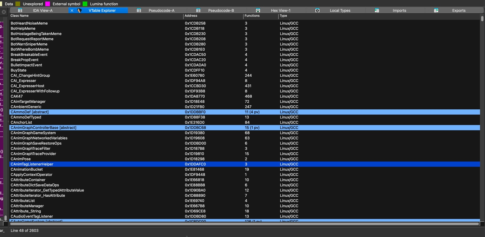
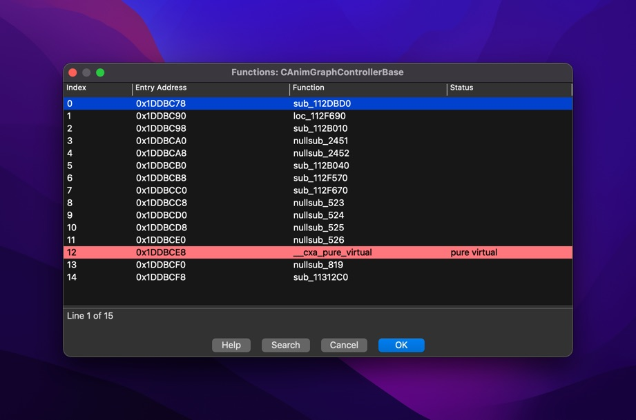
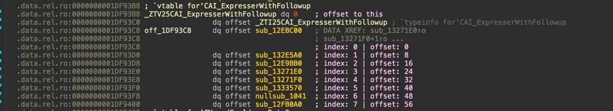
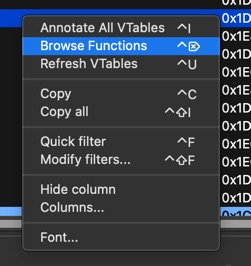

# VTable Explorer

C++ virtual table detection and annotation tool for **IDA Pro 9.x** with support for **Windows**, **Linux**, and **macOS** (Intel + Apple Silicon).

Automatically discover, navigate, and annotate virtual function tables in compiled C++ binaries.

---

## Screenshots

<p align="center">
  
  <br/>
  <em>Searchable vtable list with function counts, abstract class detection, and pure virtual indicators</em>
</p>

<p align="center">
  
  <br/>
  <em>Browse all virtual functions in a vtable with pure virtual highlighting</em>
</p>

<p align="center">
  
  <br/>
  <em>Annotated vtable with function indices and byte offsets</em>
</p>

<p align="center">
  
  <br/>
  <em>Right-click context menu with Annotate All, Browse Functions, and Refresh</em>
</p>

---

## Features

**Core Functionality**

- Symbol-based vtable detection (Linux/GCC + Windows/MSVC)
- Automatic class name extraction from mangled symbols
- Virtual function index annotation (0-based indexing)
- Searchable vtable list with 2000+ entries
- Smart offset detection (RTTI-aware)
- **Function browser** - Browse and jump to any virtual function
- **Pure virtual detection** - Identifies abstract classes automatically
- **Batch annotation** - Annotate all vtables at once

**Platform Support**

- ► IDA Pro 9.x (modern SDK)
- ► macOS ARM64 (Apple Silicon)
- ► macOS x64 (Intel)
- ► Linux x64
- ► Windows x64

**Integration**

- Native IDA chooser interface
- Context menu integration (right-click → VTable Explorer)
- Platform-specific hotkeys (⌘⇧V / Ctrl+Shift+V)
- One-click annotation and navigation

---

## Why VTable Explorer?

**Problem**: When reverse engineering C++ applications (especially games), you often need to hook or call virtual functions at runtime using their vtable index. Manually counting offsets in vtables is error-prone and time-consuming.

**Solution**: VTable Explorer automatically:

1. **Finds all vtables** - Scans for `_ZTV` (Linux/GCC) and `??_7` (Windows/MSVC) symbols
2. **Extracts class names** - Demangles symbols to show readable class names
3. **Annotates indices** - Labels each virtual function with its exact index (0-based)
4. **Enables quick navigation** - Jump between vtables and their virtual functions instantly

### Use Cases

**Runtime Hooking**

```cpp
// Without VTable Explorer: Manual counting, error-prone
void** vtable = *(void***)pObject;
auto func = (FunctionType)vtable[???];  // Which index?

// With VTable Explorer: Known index from annotations
auto func = (FunctionType)vtable[7];  // vtable index #7
```

**Reverse Engineering Games**

- Quickly locate player/entity vtables by class name
- Identify virtual function hierarchies
- Map out class inheritance structures
- Hook specific virtual methods for modding/analysis

**Code Analysis**

- Understand polymorphic behavior
- Track virtual function implementations across inheritance
- Identify unused or pure virtual functions

---

## How It Works

VTable Explorer uses **symbol-based detection** to find vtables:

**Linux/GCC Format:**

```
_ZTV6CCSBot → vtable for CCSBot
_ZTV6Player → vtable for Player
```

**Windows/MSVC Format:**

```
??_7CCSBot@@6B@ → const CCSBot::`vftable'
```

**Annotation Example:**

```
.data:1CDB018 _ZTV6CCSBot:              ; vtable for 'CCSBot'
.data:1CDB020   dq offset _ZTI6CCSBot  ; typeinfo (RTTI)
.data:1CDB028   dq offset sub_A23D00   ; index: 0 | offset: 0
.data:1CDB030   dq offset sub_A237B0   ; index: 1 | offset: 8
.data:1CDB038   dq offset sub_A283C0   ; index: 2 | offset: 16
```

---

## Installation

**1. Download** the latest release for your platform

**2. Copy** to IDA plugins folder:

- ▪ Windows: `vtable64-windows-x64.dll` → `C:\Program Files\IDA Pro X.X\plugins\`
- ▪ Linux: `vtable64-linux-x64.so` → `/path/to/ida/plugins/`
- ▪ macOS: `vtable64-macos-*.dylib` → `/Applications/IDA Pro X.X.app/Contents/MacOS/plugins/`

**3. Restart** IDA Pro

### Usage

| Method       | Shortcut                                       |
| ------------ | ---------------------------------------------- |
| Menu         | `Edit > Plugins > VTableExplorer`              |
| Hotkey       | `Ctrl+Shift+V` (Win/Linux) / `⌘⇧V` (macOS)     |
| Context Menu | Right-click in disassembly → `VTable Explorer` |

**Chooser Hotkeys:**

| Key     | Action                                              |
| ------- | --------------------------------------------------- |
| `Enter` | Annotate selected vtable and jump to it             |
| `Del`   | Open function browser for selected vtable           |
| `Ins`   | Annotate ALL vtables at once (with progress dialog) |

**Workflow:**

1. Open plugin (hotkey or menu)
2. Browse searchable list of vtables (by class name)
3. Select a vtable and press `Enter` to annotate, or `Del` to browse functions
4. In function browser: `Enter` jumps directly to any virtual function
5. Use `Ins` to batch-annotate all vtables at once

---

## Building from Source

### Prerequisites

- **Docker** - Installed and running
- **IDA SDK** - Extract to `sdk/` in project root:
  - IDA 9.x: `ida-sdk-main v9.x.zip` → rename to `sdk`

### Build All Platforms

```bash
make build
```

Builds **all 4 platforms** (Linux x64, Windows x64, macOS ARM64, macOS Intel x64) in a single Docker multi-stage container.

**Output:** `release/vtable64-{platform}-{arch}.{ext}`

See [docker/README.md](docker/README.md) for implementation details.

---

## Technical Details

**Symbol Detection Patterns:**

- `_ZTV*` - Linux/GCC vtable symbols
- `??_7*@@6B@` - Windows/MSVC vftable symbols
- `*vftable*`, `*vtbl*` - Generic fallback patterns

**Class Name Extraction:**

- IDA demangler integration
- Fallback: Itanium C++ name mangling parser
- Handles nested namespaces and templates

**Offset Detection:**

- Linux/GCC: Auto-detects RTTI offset (typically +2 qwords)
- Windows/MSVC: Starts at vtable base (offset 0)
- Smart boundary detection (stops at next vtable or invalid pointers)

**Annotation Strategy:**

- 0-based indexing (matches C++ standard)
- Includes both index and byte offset in comments (`index: X | offset: Y`)
- Skips typeinfo/RTTI pointers
- Tolerates up to 5 consecutive invalid entries for better vtable scanning
- Enhanced function detection (trusts IDA auto-generated function names)

**Pure Virtual Detection:**

- Detects `__cxa_pure_virtual` (Linux/GCC)
- Detects `_purecall` and `purevirt` (Windows/MSVC)
- Abstract classes marked with `[abstract]` in chooser
- Function count shows pure virtual breakdown: `26 (3 pv)`

---

## Credits

**Inspiration**: The concept originated from a Python vtable script by [KillStr3aK](https://github.com/KillStr3aK), which I used extensively for reverse engineering workflows. While the original script served its purpose well, I decided to create a full-featured IDA plugin with native UI support and cross-platform compatibility, particularly for macOS environments where plugin integration is preferred.

**Build System**: Adapted from my [IDA-Fusion-Enhanced fork](https://github.com/K4ryuu/IDA-Fusion-Enhanced)

## License

MIT License - Free for personal and commercial use
